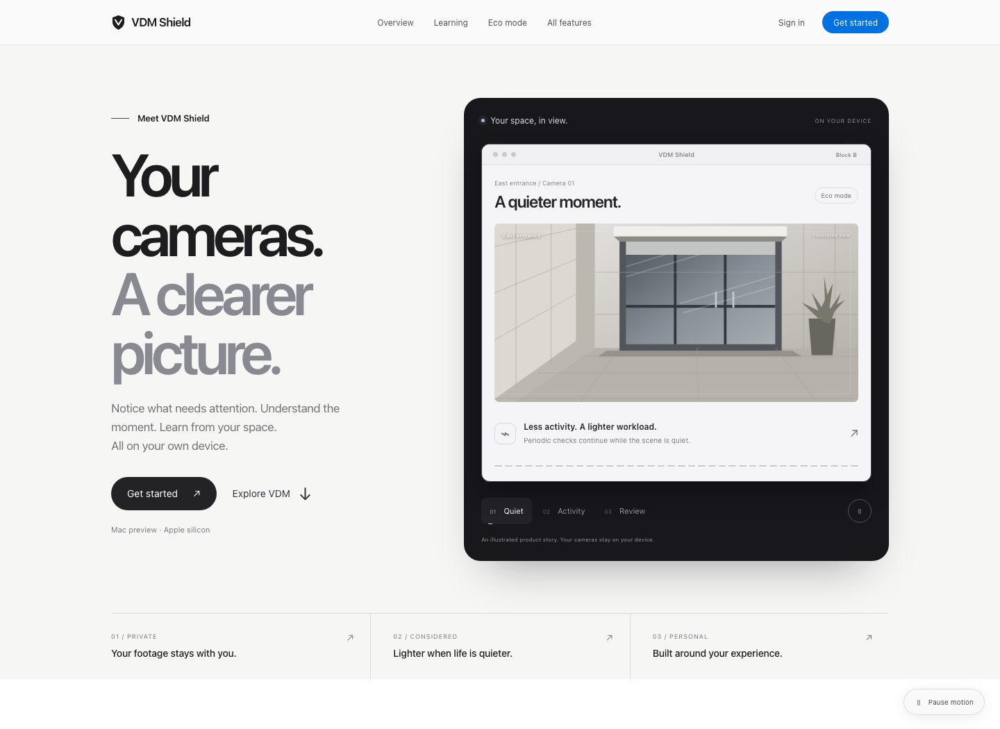
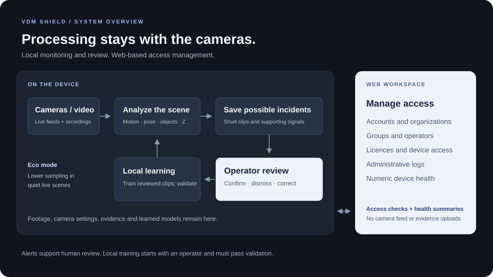

# VDM Shield

Camera monitoring that runs on your own device, with a separate website for managing the people who use it.

VDM watches live cameras or recorded video, flags moments that may need attention, and keeps short clips for an operator to review. Camera setup, video processing, evidence and local model training all happen on the device. The web workspace handles accounts, groups, licences and administrative logs.

[Visit the website](https://vdm-shield-c497900ed597.herokuapp.com) · [Architecture](docs/system-architecture.md) · [Setup notes](docs/development-notes.md) · [Training notebook](notebooks/weapon_training_colab.ipynb)



*The product website. Its animated scenes explain the workflow; they are illustrations, not recorded detections.*

## What you can do

- **Connect cameras or upload a recording.** Use a USB webcam, an HTTP/RTSP stream, or a supported video file. The current app supports up to four simultaneous sources; actual throughput depends on the machine and footage.
- **Review possible incidents.** Fight, fall, person-down, hands-up and visible-weapon signals enter a local review queue. Open the evidence, confirm an event, dismiss a false alarm or correct its label.
- **Use less compute when a camera is quiet.** Eco mode lowers sampling during still scenes and restores normal processing when motion returns. Periodic weapon checks continue while the scene is quiet.
- **Train from your own reviewed clips.** Collect examples from the installation, correct their labels and start local training. A candidate must pass held-out checks before it replaces the active clip classifier.
- **Organize access by site or group.** An administrator can create a group such as “Block B”, invite several operators, assign device access and revoke it when needed. Each operator gets access to their assigned groups.
- **See device health.** The local dashboard shows camera freshness, processing speed, worker status, disk space and evidence-write problems. The web workspace receives a small allowlist of numeric health summaries.

Alerts are suggestions for review. Fast hand movements, occlusion, small objects and unfamiliar scenes can still cause mistakes. The system does not establish intent or replace an operator’s judgement.

## How it fits together



There are two Python applications in this repository:

| Application | Runs where | Responsible for |
| --- | --- | --- |
| Device app (`vmd/`) | The installation’s Mac or local machine | Cameras, inference, incident clips, review and local learning |
| Web workspace (`vdm_cloud/`) | Heroku, or localhost during development | Accounts, organizations, groups, licences, access logs and numeric device status |

Video, camera connection details, saved evidence and locally learned model files stay on the device. A managed installation contacts the workspace to renew its licence, so it still needs periodic network access.

On the device, capture feeds independently scheduled workers. Pose and motion run frequently; objects and relative depth are sampled in the background. The main view does not wait for every model to finish. Fight confirmation combines tracked-pair evidence with fresh, compatible depth and at least five seconds of supported interaction. Relative depth is a near/far comparison within one frame, not distance in metres or proof of contact.

The [architecture guide](docs/system-architecture.md) has a general flow, a technical flow and the relevant source files. The [engineering guide](docs/engineering-guide.md) covers thresholds, recovery, evidence storage and the limits of the current implementation.

## Run it locally

Use Python **3.11–3.13**. The cloud deployment uses 3.13. The commands below use a virtual environment so the project’s dependencies stay separate from your system Python.

```sh
git clone https://github.com/00surya/vdm-shield.git
cd vdm-shield
python3.13 -m venv .venv
```

### Website and account workspace

```sh
.venv/bin/python -m pip install -r requirements-cloud.txt
.venv/bin/python run_cloud.py
```

Open **http://127.0.0.1:8766**. The development launcher uses SQLite and shows local account-verification links without an email provider. This preview is restricted to localhost. Production uses PostgreSQL and real email delivery.

### Device application

In another terminal:

```sh
.venv/bin/python -m pip install -e '.[vision,depth-export,desktop,test]'
.venv/bin/python scripts/download_models.py
.venv/bin/python run.py
```

Open **http://127.0.0.1:8765**. Model setup downloads the required weights and exports the depth model to ONNX, so the first setup takes longer than a normal launch. The weights are not stored in Git.

Start with a short recording, check that all workers are ready, then connect a camera. `device.py` opens the same local application in a kiosk browser. The native Mac launcher and packaging instructions are in [desktop distribution](docs/desktop-distribution.md).

The local dashboard binds to loopback. Camera credentials and evidence are stored under `data/`; protect that directory and its backups. See [device setup and access provisioning](docs/development-notes.md#appliance-provisioning-and-recovery) before configuring a shared installation.

## Models and training

The live pipeline currently uses YOLO11n pose, optical flow, ZipDepth through ONNX Runtime, YOLO26s for general objects and a separate YOLOv8n threat detector. The local clip learner uses a frozen ResNet18 encoder with a trainable GRU head. Reviewing clips trains that clip classifier; it does not fine-tune the object or depth models.

A separate **five-class weapon and ordnance detector** has completed 30 epochs followed by 20 additional fine-tuning epochs. The second phase starts with fresh optimizer state. This is a candidate model and **has not replaced the detector in the application**.

| Evaluation of the 50-epoch candidate | Result |
| --- | ---: |
| Test images | 1,434 |
| Precision | 72.10% |
| Recall | 65.84% |
| mAP@50 | 71.35% |
| mAP@50–95 | 50.32% |

These are results on the prepared public-image test split, including close-up ordnance photographs. They do not measure false alarms per camera-hour or establish CCTV performance. The classes are gun, knife, grenade, bomb and other ordnance; a camera cannot determine whether an object contains live explosives.

The data comes from [fcakyon/gun-object-detection](https://huggingface.co/datasets/fcakyon/gun-object-detection) and [CTX-UXO](https://huggingface.co/datasets/UXO-Politehnica-Bucharest/Contextual_Vision_for_Unexploded_Ordnances). Source attribution, class mappings, checksums, split limitations and the complete results are in the [experiment notes](docs/weapon-ordnance-experiment.md).

For another run, start with the [Colab notebook](notebooks/weapon_training_colab.ipynb) and [training kit](docs/weapon-colab.md). The scripts download and prepare data, validate annotations, train, evaluate and export. `scripts/export_weapons.py` provides ONNX, OpenVINO, Core ML and TensorRT targets with platform-specific prerequisites. Conversion alone does not guarantee a speedup: benchmark and evaluate the exported model on the intended device.

## Working on the project

```text
desktop/        Native Mac launcher and packaging configuration
vmd/            Device application, camera workers and local learning
vdm_cloud/      Website, accounts, groups and licensing service
scripts/        Model setup, training, export, benchmarks and packaging
notebooks/      Colab training notebook
tests/          Device, cloud and data-preparation tests
docs/           Architecture, deployment and operator/engineering notes
deploy/         Example deployment configuration
```

Run the tests after installing the device and cloud dependencies:

```sh
.venv/bin/python -m pip install -r requirements-cloud.txt
.venv/bin/python -m pytest -q
```

Model smoke checks and camera benchmarks are separate from the unit tests. See [pipeline checks](docs/development-notes.md#check-the-fixed-pipeline) for those commands. Report measured processing FPS, dropped frames and alert quality separately; an inference-speed result is not an accuracy result.

## Deployment and current status

The website is hosted on [Heroku](https://vdm-shield-c497900ed597.herokuapp.com). `Procfile` starts Gunicorn and initializes missing database tables during release; it is not a schema-migration system. The root `requirements.txt` installs only the cloud dependencies. Keep secrets in Heroku config vars, using [the example configuration](deploy/heroku.env.example) as a reference.

See [Heroku deployment](docs/heroku-deployment.md) for repository deployment, checks and operational details.

GitHub runs the cloud tests on pushes to `main`. A build from this repository has been verified on Heroku; automatic deployment is still waiting for the Heroku account's GitHub connection.

Still to finish before customer distribution:

- Configure and test production email. Registration and password recovery are unavailable on the live site until a sender is configured.
- Publish a signed, notarized Mac installer through durable download storage. The repository contains the build tooling; a production installer is not included here.
- Validate alerts and sustained multi-camera performance on the hardware and scenes being sold. The Mac application currently uses CPU inference for stability.
- Evaluate and integrate the newer weapon candidate, including its different class mapping, before presenting its benchmark as the live detector’s result.

## Licences and included files

This repository contains source, tests, documentation and small interface assets. It excludes accounts, secrets, camera footage, training datasets, model weights and generated installers.

No project-wide software licence has been selected yet. Public availability does not grant permission to redistribute the project. Third-party components retain their own terms: Ultralytics has AGPL-3.0/enterprise licensing, the public training datasets require attribution, and bundled fonts and browser libraries include their notices. Review the applicable terms before distributing a commercial build.
