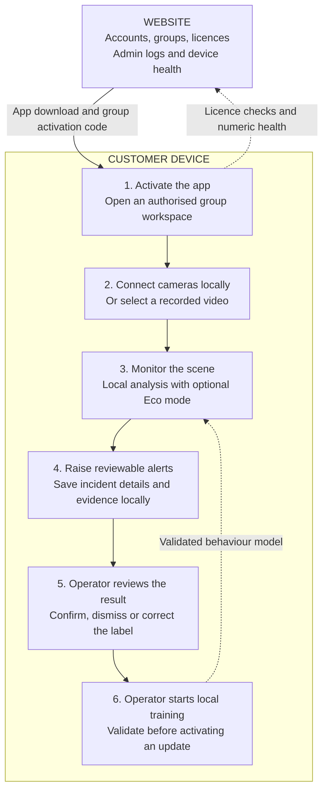
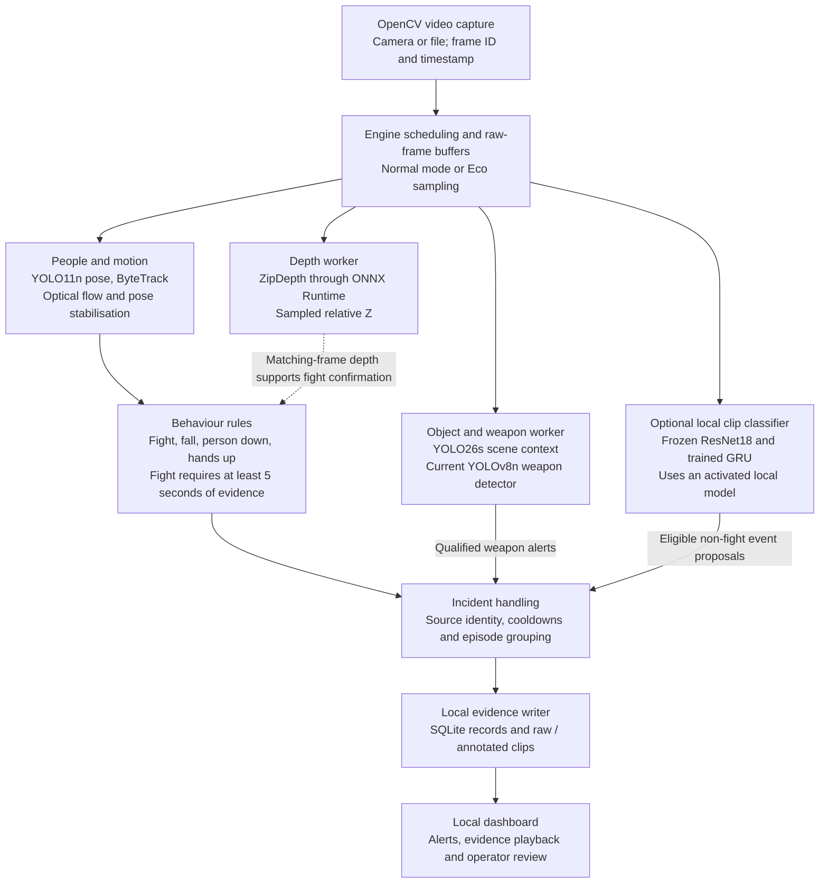

# VDM application architecture

Verified against the current source on 23 September 2026. These diagrams describe the implemented application. The newly trained weapon detector is a separate candidate, as noted below.

## 1. General architecture

The website manages people and access. The customer's device connects to cameras, analyses video, saves evidence and runs local learning.

- An administrator creates groups and invites operators; multiple users can belong to one group. Each installation receives its own activation code.
- Camera setup, video analysis, footage, detailed incidents and learned behaviour models stay on the device. Group workspaces separate that device's local data.
- The website receives numeric device-health summaries and aggregate alert/review counts. Website administration logs are separate from local incident footage and detailed event records.
- Managed installations periodically renew their licence through the website. On-device video processing does not imply indefinite operation without a valid licence connection.
- Local learning is operator-guided: collect clips, review labels, start training and pass validation. It is not automatic retraining from every prediction.

## 2. Technical processing architecture

The desktop shell uses PyWebView (with a browser fallback) to display a local Flask application on `127.0.0.1`. Its controllers call `SourceManager`, which creates one `Engine` per source, subject to the licensed allowance and the current four-source cap.

This is the logical flow inside each engine. Worker arrows represent independently scheduled results, not a barrier that waits for every model on every frame.

The live frame display also updates while these branches work. General scene-object detections provide context; they do not independently trigger weapon alerts. Unusual person-region motion has an additional lower-priority anomaly path after local calibration.

### Scheduling and confirmation

| Behaviour | Current implementation |
| --- | --- |
| Normal processing | Pose/motion targets 20 FPS by default; depth targets 1 FPS; the combined object/weapon worker targets 2 FPS. These are scheduling targets, not guaranteed throughput. |
| Quiet Eco mode | Live cameras retain about 1 pose scan/second, 1 object/weapon scan/second and 1 depth scan every 10 seconds. Motion restores active sampling; checking an interaction keeps it active. Uploaded recordings use normal processing. |
| Parallel work | Depth and object/weapon work run in separate processes from the main pose loop. General objects and specialist weapons share one worker and run sequentially inside it. Temporal clip inference runs through a background executor when an active model is available. |
| Frame association | Frame/session identity and source timestamps prevent delayed results from being treated as observations of a newer frame. The engine schedules depth requests and gives event frames priority. |
| Fight confirmation | The same tracked pair needs reliable poses, box overlap, sufficient person-region motion, interaction evidence and fresh compatible depth observations for at least five supported seconds. Missing/stale depth prevents a confirmed fight alert. |
| Meaning of depth | Relative near/far values within the sampled frame. They are not metres, proof of physical contact or evidence of intent. |
| Combining signals | Existing heuristics and specialist weapon alerts remain active. Eligible local-model events can add alerts. A learned “normal” result does not cancel other detectors; clip predictions cannot bypass fight confirmation. This is not calibrated probability averaging. |
| Mac execution | The current multi-source application selects CPU inference for stability. The separate 50-epoch training experiment used the Apple GPU. |

### Two different types of training

**Local behaviour learning:** raw incident/normal clips → operator review and corrections → operator starts training → frozen ResNet18 features and trainable GRU head → source-held-out validation → activate only if promotion and class-coverage checks pass. Everything in this loop is local. Unreviewed model-generated event labels do not train themselves, and this workflow does not fine-tune the object or depth detectors.

**Weapon detector fine-tuning:** public images with bounding boxes → separate dataset preparation → YOLO26n training → held-out evaluation → ONNX export and evaluation. The completed 30-epoch run and 20-epoch fine-tuning extension produced a five-class candidate for gun, knife, grenade, bomb and other ordnance. It is **not yet wired into the live application's threat detector**. The live code still loads `models/threat-yolov8n.pt`, whose classes include gun, knife, grenade and explosion-like visuals. Training a checkpoint does not replace that runtime integration or class mapping.

### Component map

| Component | Responsibility | Source |
| --- | --- | --- |
| Website service | Accounts, groups, roles, device activation, licence checks, administrative records, health summaries and downloads; Flask + SQLAlchemy. Development uses SQLite; production configuration expects PostgreSQL. | `vdm_cloud/app.py`, `vdm_cloud/models.py`, `vdm_cloud/people.py`, `vdm_cloud/licensing.py` |
| Desktop shell | Launch the local app, display the UI and locate per-user data/models. | `desktop/launcher.py` |
| Device API and access | Local Flask routes, licence enforcement and organisation/group workspace selection. | `vmd/app.py`, `vmd/controllers/`, `vmd/licensing.py` |
| Source lifecycle | Configure, start, stop and recover camera engines. | `vmd/models/sources.py` |
| Processing | Capture, scheduling, independent workers and event coordination. | `vmd/capture.py`, `vmd/engine.py`, `vmd/eco.py` |
| Model adapters and rules | Pose/tracking, motion, depth, objects, specialist threats and temporal confirmation. | `vmd/vision.py`, `vmd/tracking.py`, `vmd/depth_worker.py`, `vmd/objects.py`, `vmd/threats.py`, `vmd/behavior.py`, `vmd/confirmation.py` |
| Evidence and review | Local SQLite, evidence clips, episode grouping, retention and review records. | `vmd/storage.py`, `vmd/evidence.py`, `vmd/episodes.py` |
| Local learning | Clip features, temporal classifier, training and guarded promotion. | `vmd/learning.py`, `vmd/temporal.py` |
| Website health sync | Explicit numeric-only metadata; no footage or camera credentials. | `vmd/metadata.py` |

The website is a separate management service and does not sit in the camera-to-alert processing path. Devices assigned to the same group do not currently share video or evidence through the website.
